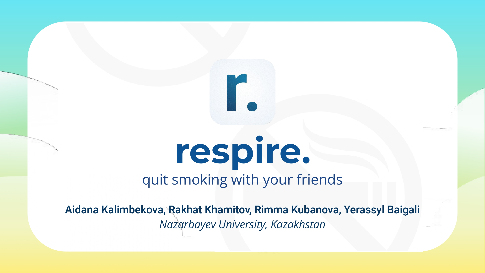
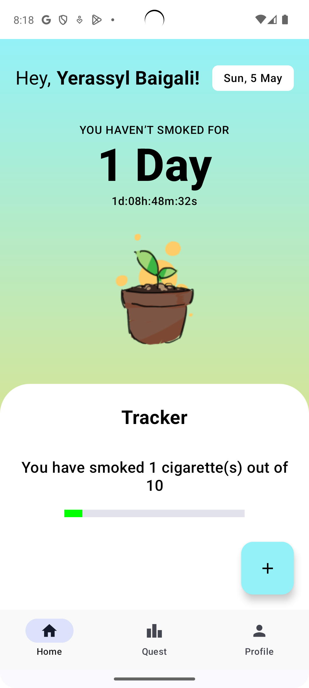
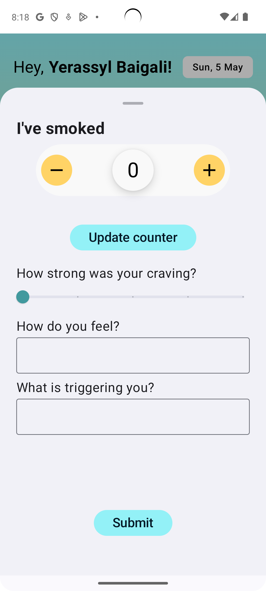
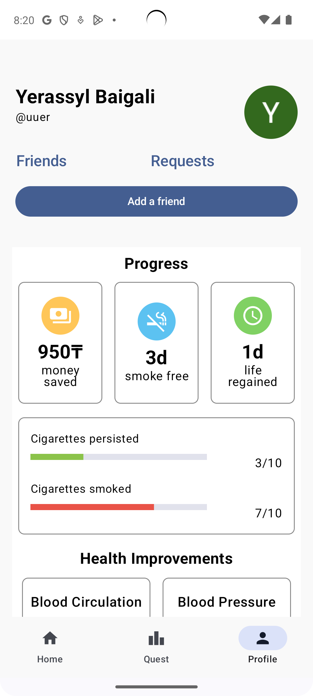
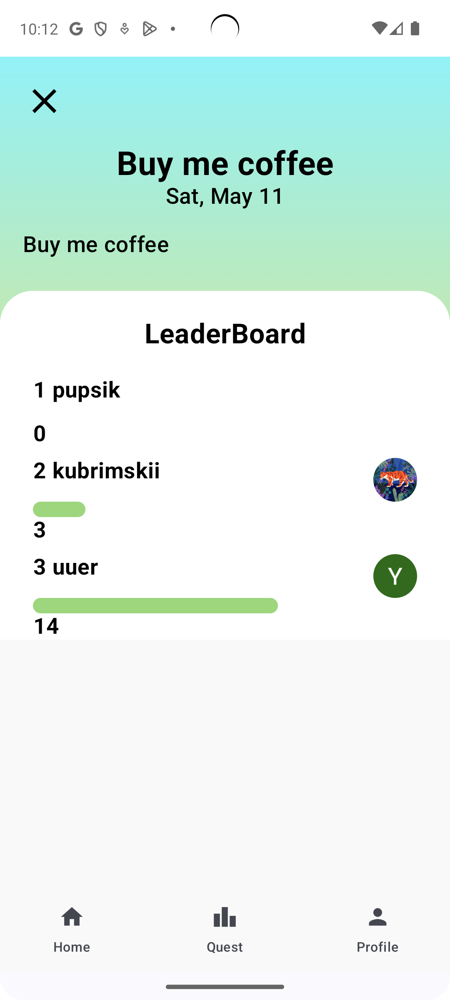
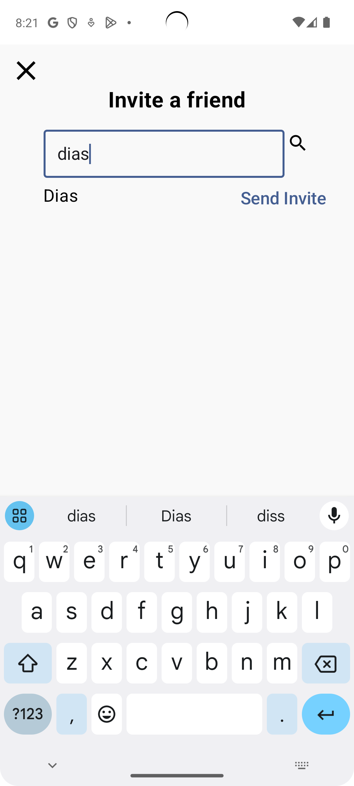
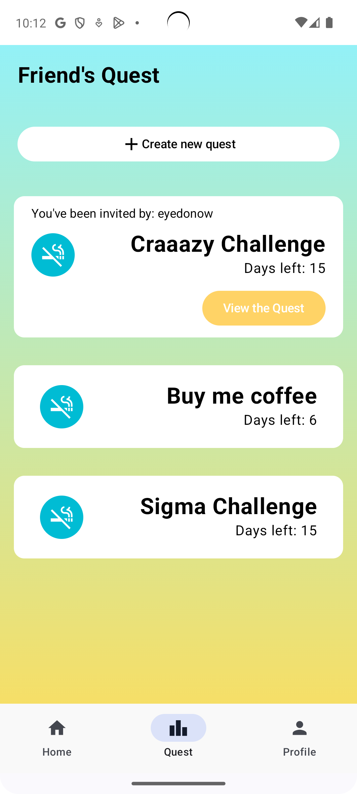
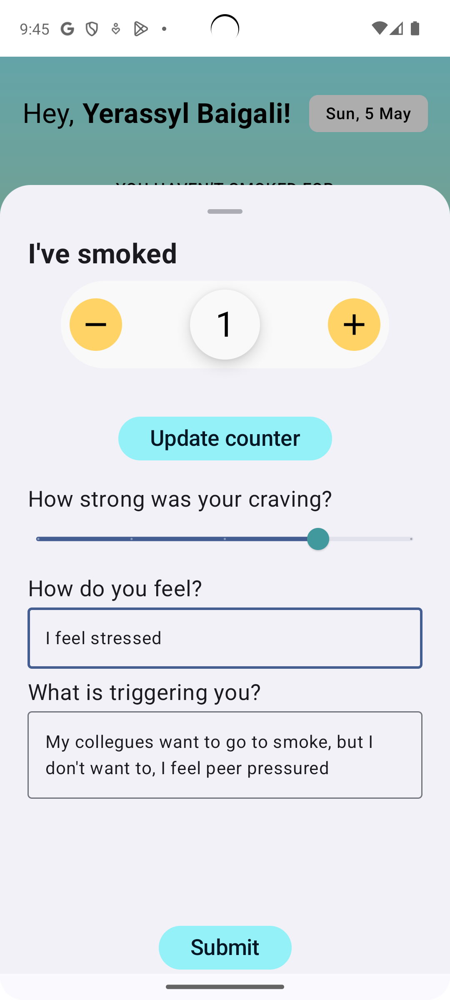
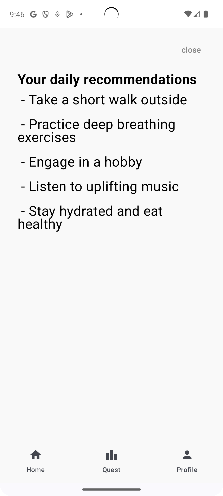

# Respire API Go
Our project, "**respire.**", aims to address the issue of smoking addiction by fostering a collaborative and supportive environment around users. Recognizing that quitting smoking is a challenging endeavor that benefits greatly from encouragement and accountability, our project leverages the power of community and technology to create a unique support system for its users.

This repository is a backend app for our android app. 

## Table of Contents

- [Respire API Go](#respire-api-go)
  - [Table of Contents](#table-of-contents)
    - [Link to the Mobile app's  source code:](#link-to-the-mobile-apps--source-code)
  - [Overview](#overview)
    - [Demo Video](#demo-video)
  - [Technologies](#technologies)
  - [UN Sustainable Development Goals And Targets](#un-sustainable-development-goals-and-targets)
  - [Core functionalities](#core-functionalities)
    - [Smoking Habbits Tracker](#smoking-habbits-tracker)
    - [Social Networking and Engaging in Cooperative Challenges](#social-networking-and-engaging-in-cooperative-challenges)
    - [Personalized AI Generated Daily Recommendations to Cope with Cravings](#personalized-ai-generated-daily-recommendations-to-cope-with-cravings)
  - [Installation](#installation)
    - [Prerequisites](#prerequisites)
    - [Clone the repository](#clone-the-repository)
    - [Install dependencies](#install-dependencies)
  - [Usage](#usage)
    - [Build and run the application](#build-and-run-the-application)
  - [Configuration](#configuration)
  - [Swagger documentation](#swagger-documentation)

### Link to the Mobile app's  source code:
https://github.com/aidanakalimbekova/respire-mobile

## Overview

### Demo Video

> Youtube Video Link: [https://www.youtube.com/watch?v=XZaXcsDsGV4](https://youtu.be/B7IVdjwAz60?si=q3IRj3_KTUFKOEeb)

___

## Technologies
<div align="center">
	
	
	
    
    
     
     
</div>

## UN Sustainable Development Goals And Targets


## Core functionalities
### Smoking Habbits Tracker
<div align="center">
	
    
	
</div>

### Social Networking and Engaging in Cooperative Challenges
 <div align="center">
	
    
	
</div>

### Personalized AI Generated Daily Recommendations to Cope with Cravings
<div align="center">
	
    
</div>

## Installation
### Prerequisites

- Go (version 1.21.4)

### Clone the repository

```bash
git clone https://github.com/Brainsoft-Raxat/respire-api-go.git
cd repository
```
### Install dependencies
```bash
go get ./...
```

## Usage
### Build and run the application
```bash
go build ./cmd/app/main.go -o app .
./app
```

By default, the application will run on localhost:8080.

## Configuration
- Edit config.yaml according to your configs.
- When local development set ***env*** to 'local' and ***host*** to localhost.
- Feel free to set any port you want.
- Download **Firebase SDK JSON** configuration and put it into project root directory. In our case file is named as "quitsmoke-20141-firebase-adminsdk-ugo14-c5730ea21d.json"
  
## Swagger documentation
https://respire-api-go-jc4tvs5hja-ey.a.run.app/swagger//index.html#/users/get_user_search

